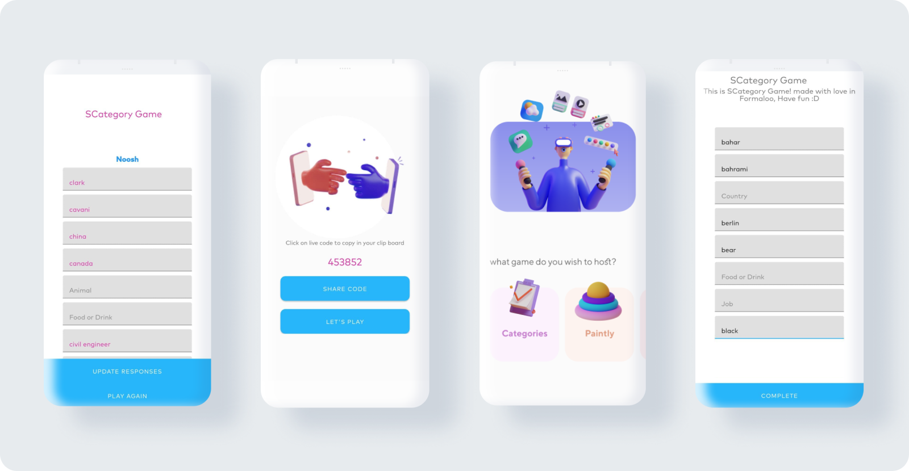

# QuizApp Android Application
QuizApp is an Open Source SCategory Game that displays the way you can use [Formaloo](https://en.formaloo.com/) [api](https://en.formaloo.com/developers/) in your project.

## Installation
Clone this repository and import into **Android Studio**

git clone https://github.com/formaloo/quiz-app-android.git

## The App
Here are some of the formaloo features use in app with Formaloo API:
* create, edit, disable the form
* Authentication with formaloo ICAS
* Access to the responses sent to the form without token with live code (Formaloo Live)
* Use of hidden and admin only fields for name, score and status

[The APK is available now in the Myket Store](https://myket.ir/app/com.formaloo.quizapp).

QuizApp

## Modular Architecture
This project is developed with modular architecture. **QuizApp project** developed in [game module](https://github.com/formaloo/quiz-app-android/tree/master/game) and **FlashCard project** developed in [feature module](https://github.com/formaloo/quiz-app-android/tree/master/feature). These modules are independent from each other and use the base modules: common, data and auth.
so you can use flashcard beside game in project

see [flashcard learning app](https://github.com/formaloo/formaloo-android-learn-android-development)

### Libraries used
The application supports Android 4.4 KitKat (API level 19) and above.

* Kotlin language
* AppCompat, RecyclerView
* Navigation
* Coroutines
* Koin di
* Retrofit 2

You can also find the full documentation on the [developers page](https://en.formaloo.com/developers/)

